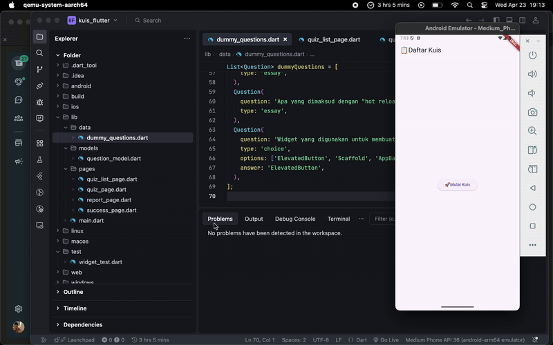

# 📱 Aplikasi Kuis Pengoding Handal

Aplikasi ini adalah kuis interaktif berbasis Flutter yang menguji pengetahuan pengguna seputar topik umum dan pengembangan Flutter. Cocok untuk belajar sambil main-main!

## 🎯 Fitur Utama

- ✍️ Soal dengan berbagai tipe: pilihan ganda, benar/salah, dan esai
- ⏱️ Timer otomatis 2 menit per sesi kuis
- 🔄 Navigasi antar soal dengan tombol Sebelumnya dan Selanjutnya
- ✅ Penilaian otomatis untuk soal pilihan dan benar/salah
- 📊 Halaman laporan hasil dengan skor dan feedback motivasional

## 🧠 Struktur Soal

Soal didefinisikan dalam model Question:

dart
class Question {
final String question;
final String type; // 'choice', 'truefalse', atau 'essay'
final List<String>? options;
final dynamic answer;

Question({
required this.question,
required this.type,
this.options,
this.answer,
});
}

Data dummy soal-soal tersedia di file [dummy_questions.dart](./data/dummy_questions.dart).

## 🛠️ Struktur Proyek

lib/
├── data/
│ └── dummy_questions.dart # Daftar soal
├── models/
│ └── question_model.dart # Model soal
├── pages/
│ ├── quiz_list_page.dart # Halaman awal
│ ├── quiz_page.dart # Halaman pengerjaan kuis
│ ├── success_page.dart # Konfirmasi setelah submit
│ └── report_page.dart # Hasil kuis dan feedback
├── main.dart # Entry point

## 🚀 Cara Menjalankan

Pastikan kamu sudah install Flutter SDK. Lalu jalankan:

bash
flutter pub get
flutter run

Aplikasi akan tampil dan langsung mengarah ke halaman daftar kuis.

## 🧪 Contoh Soal

- _Pilihan Ganda:_ "Apa ibu kota Indonesia?" → Jakarta
- _True/False:_ "Flutter dikembangkan oleh Apple?" → False
- _Essay:_ "Jelaskan apa itu widget di Flutter."

## 📈 Skor dan Evaluasi

Setelah submit, pengguna akan melihat skor akhir dan mendapatkan feedback berdasarkan performa:

| Skor   | Feedback                                  |
| ------ | ----------------------------------------- |
| 90-100 | 🔥 Gokil! Kamu emang jagoan Flutter!      |
| 80-89  | 💪 Keren! Tinggal dikit lagi jadi master. |
| 70-79  | 👌 Lumayan! Tapi masih bisa ditingkatin.  |
| 60-69  | 😅 Belajar dikit lagi yuk.                |
| <60    | 📚 Ayo semangat belajar lagi!             |

## 💡 Ide Pengembangan Selanjutnya

- Integrasi ke backend untuk menyimpan skor
- Randomisasi soal setiap sesi
- Tambahkan leaderboard dan login pengguna
